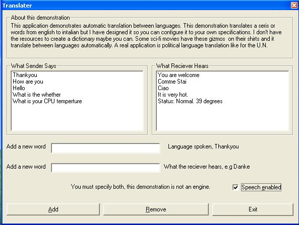



## Language Translator Gizmo Speech Recognition

### Description

Translates langauges, I say Hello into microphone, computer says Ciao out of speaker. like those Sci-Fi Translation Gizmo in the movie The Last Star Fighter. Maybe the U.N can make use of it.

You will need the 5.1 speech sdk get this operating.

http://www.microsoft.com/speech/download/sdk51/

Email me if you have any problems.
 
### More Info
 

             |
---                |---
**Submitted On**   |2002-04-13 01:05:58
**By**             |[TonyGG](https://github.com/Planet-Source-Code/PSCIndex/blob/master/ByAuthor/tonygg.md)
**Level**          |Beginner
**User Rating**    |4.8 (43 globes from 9 users)
**Compatibility**  |VB 6\.0
**Category**       |[Complete Applications](https://github.com/Planet-Source-Code/PSCIndex/blob/master/ByCategory/complete-applications__1-27.md)
**World**          |[Visual Basic](https://github.com/Planet-Source-Code/PSCIndex/blob/master/ByWorld/visual-basic.md)
**Archive File**   |[Language\_T713844122002\.zip](https://github.com/Planet-Source-Code/tonygg-language-translator-gizmo-speech-recognition__1-33738/archive/master.zip)

